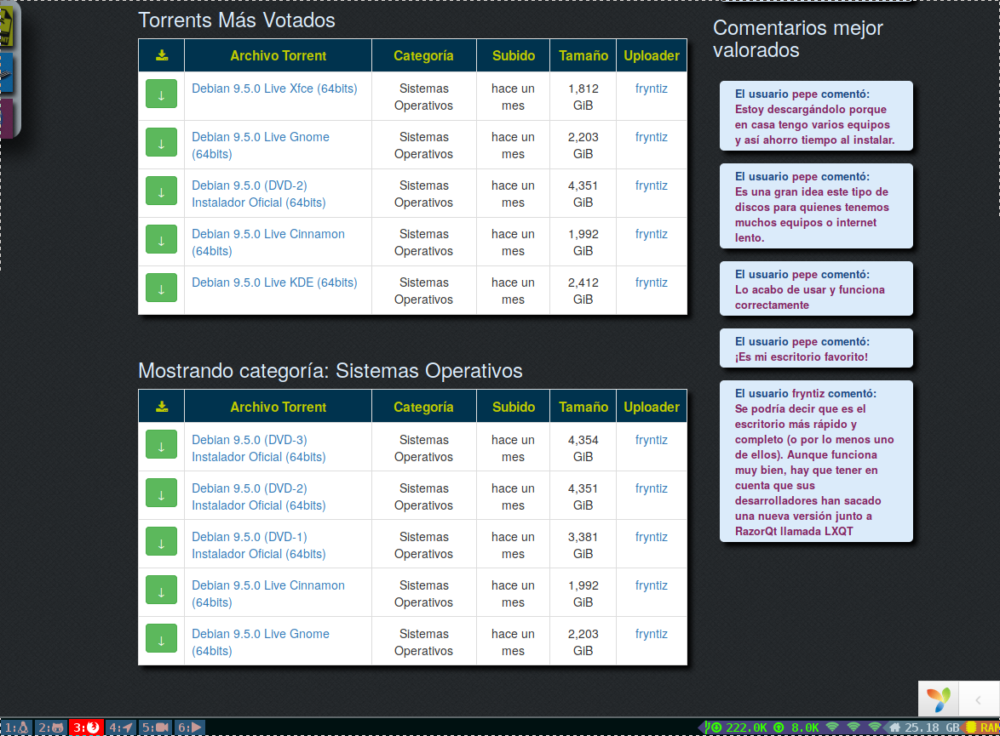
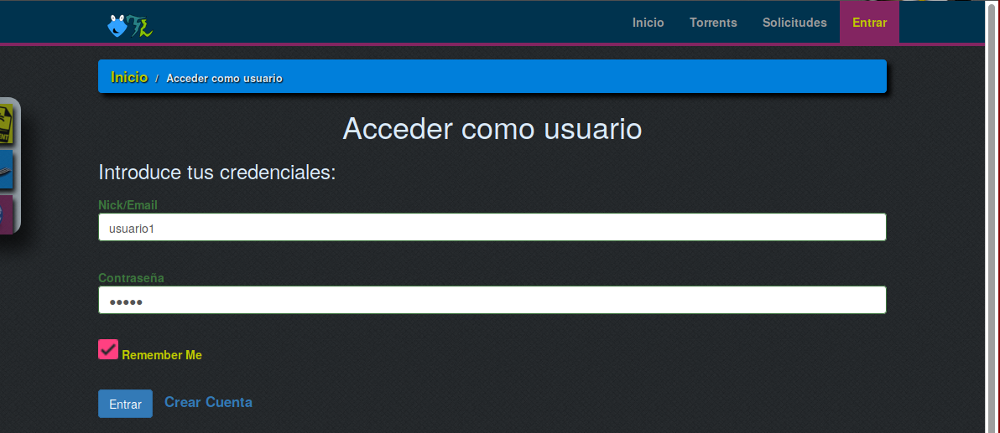
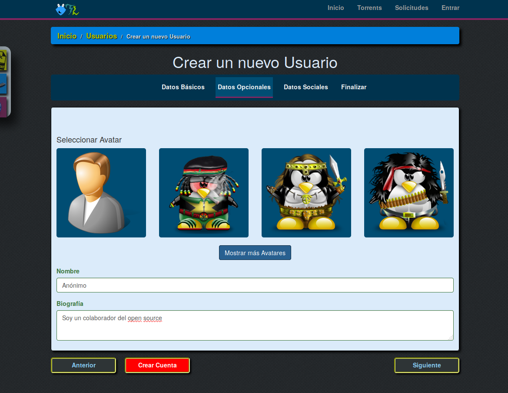
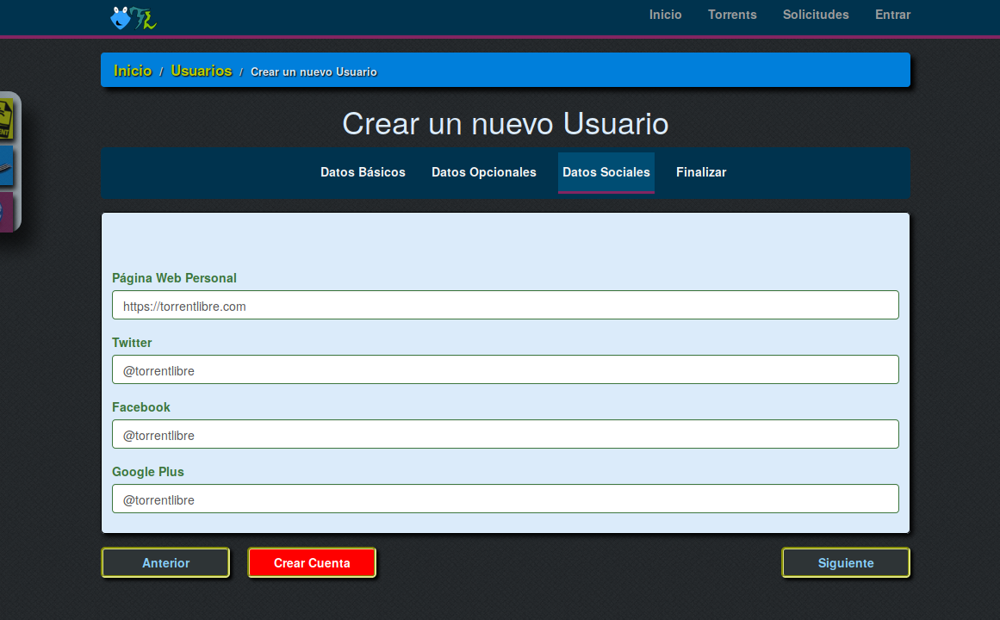
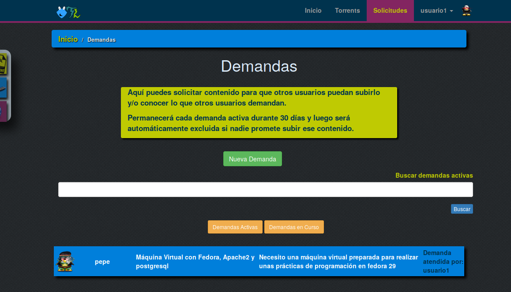

# Manual de usuario

Esta aplicación está disponible sin necesitar tener cuenta para navegar y/o
descargar el material compartido.

## Portada

Al acceder a la página principal encontramos un resumen de las últimas subidas,
últimos comentarios, torrents mejor puntuados, y comentarios mejor puntuados.

## Torrents

En la sección torrents encontramos todos los torrents ordenados por últimas
subidas.

Se dispone de un buscador en el que podemos filtrar por nombre, descripción y
categoría.

## Solicitar incluir material

Es posible solicitar que se añada nuevo material.

Para ver lo que otros usuarios han solicitado entramos en la sección
**solicitudes**

Podemos ver lo que otros usuarios han solicitado/demandado pero es necesario
entrar en la aplicación para responder a esa solicitud.

En el botón "**Yo lo subo**" indicamos que nos hacemos cargo de una solicitud.

En la siguiente sección vemos como crear cuenta en la aplicación.

## Crear cuenta de usuario

Cuando pulsemos sobre alguna acción que requiera tener cuenta o pulsemos sobre
el botón **Entrar** nos redirigirá a la ventana de login y/o crear cuenta.

Si es la primera vez que accedemos necesitamos crear la cuenta pulsando sobre
**Crear Cuenta**

La creación de cuentas requiere pocos campos obligatorios y ninguno personal ya
que en esta aplicación el material es el protagonista y no se requieren datos
personales de usuario más que unas credenciales básicas.

Los campos requeridos son:
- nick
- email
- contraseña
- captcha

Podemos rellenar los datos opcionales y sociales en caso solo de interesarnos.

En el apartado de datos sociales opcionalmente podemos elegir un avatar que 
nos represente o simplemente parezca curioso (de no hacerlo se tomará el que
existe por defecto)

Si queremos compartir nuestras redes sociales disponemos de un apartado dónde
puedes introducir:
- tu web
- twitter
- facebook
- google plus

Finalmente nos quedará introducir el captcha demostrando que no somos un bot y
aceptar las políticas del sitio tras haberlas leído detenidamente.

Una vez hemos pulsado **Crear Cuenta** seremos redirigidos a nuestro espacio
de usuario recién creado.

## Nuestro usuario

El usuario es una representación de nosotros identificándonos mínimamente.

Desde nuestro perfil podemos observar la cantidad de descargas que hemos 
realizado, nuestro avatar, biografía, redes etc etc

Para el público solo será visible la siguiente parte:

De forma que el email y preferencias quedarán ocultos al resto de usuarios.

Ahora en el apartado de **Solicitudes** podemos atender demandas de otros
usuarios y ver todas las que han sido atendidas pulsando **Demandas en Curso**

## Descargar Torrents

## Reportar torrent

## Puntuar Torrent

## Añadir comentario

## Reportar comentario

## Puntuar comentario

## Subir torrent

## Limitaciones al subir torrents basado en rangos
